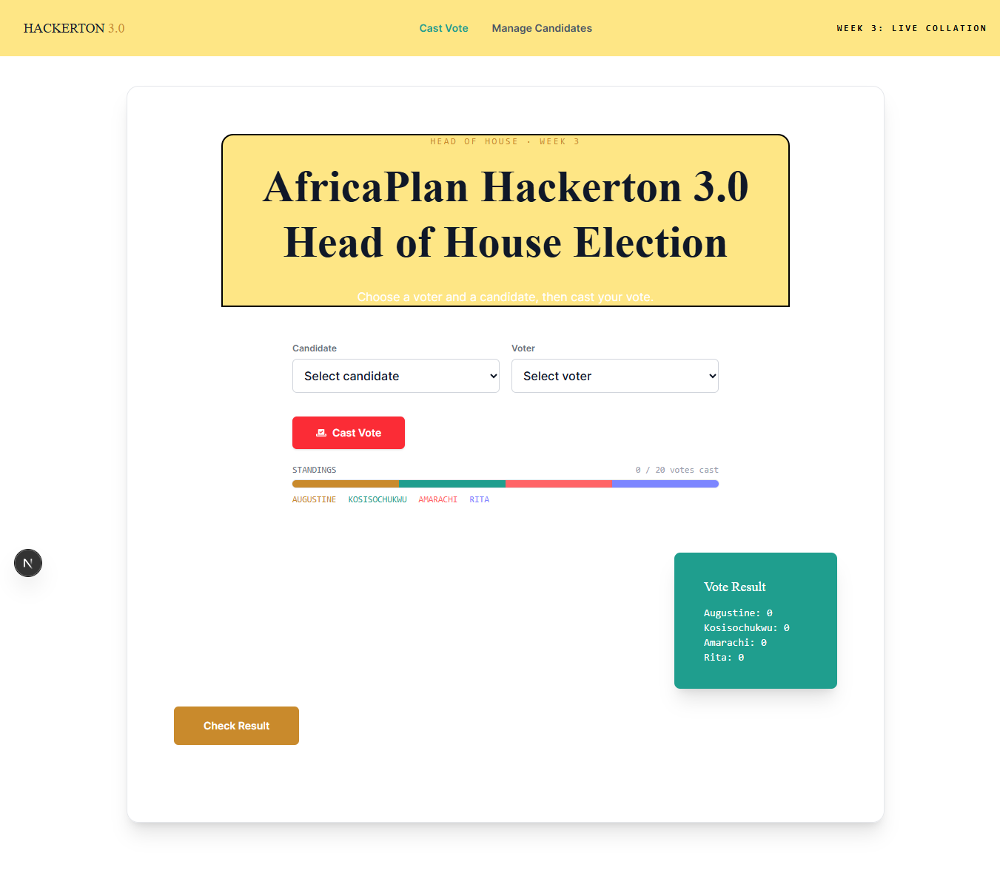
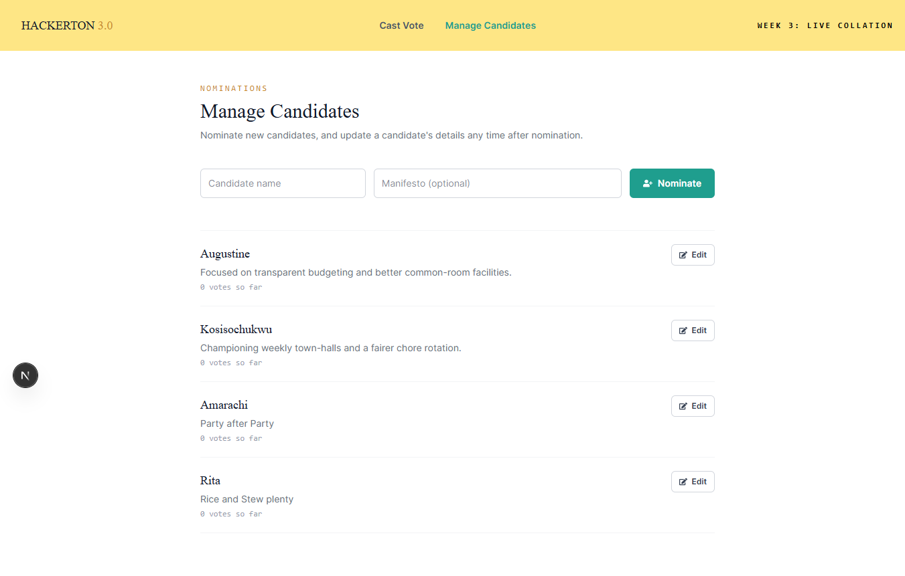
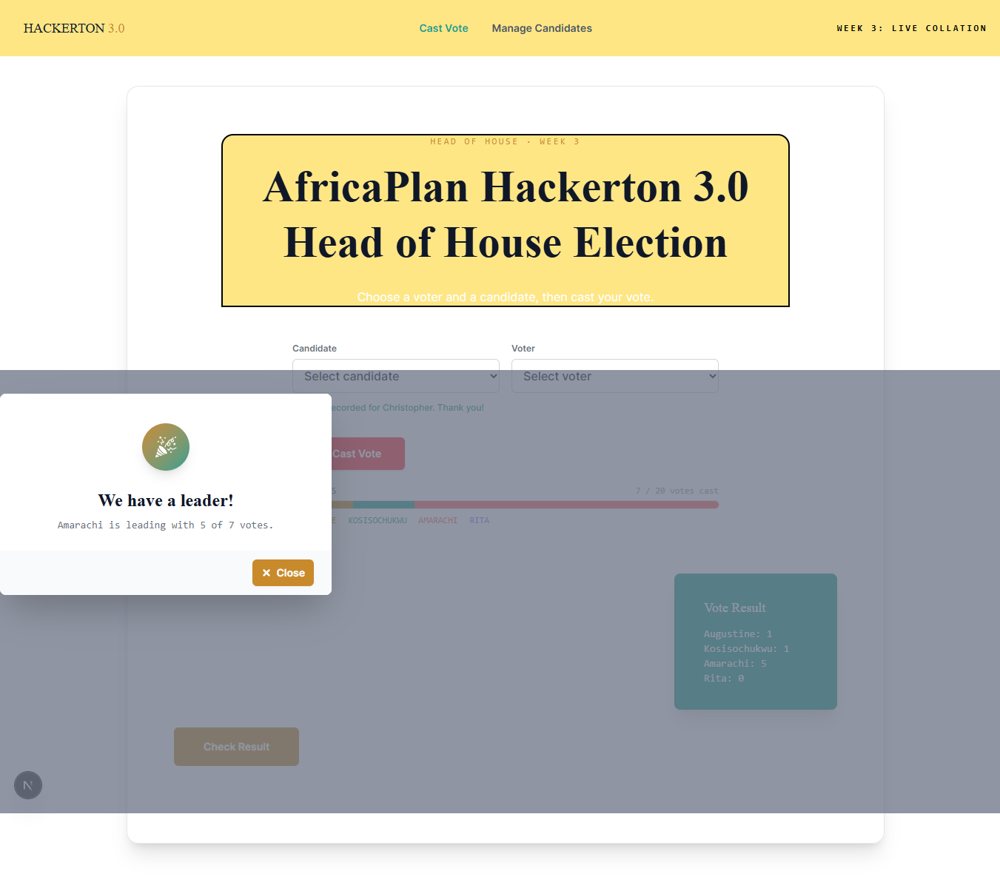

Hackerton 3.0 — Voting Application

A responsive election voting application rebuilt with **Next.js, React, TypeScript, Tailwind CSS, React Icons, and TanStack Query**.

The application allows a fixed group of participants to nominate and edit candidates, cast a single vote, and view the current election standings. The two candidates with the highest vote totals emerge as **HOH (Head of House)** and **AHOH (Assistant Head of House)**.

---

 Overview

This project is a Next.js rebuild of an earlier vanilla HTML, CSS, and TypeScript voting interface.

The rebuild focuses on moving from direct DOM manipulation and hardcoded UI state toward:

- Component-based React architecture
- Type-safe data contracts with TypeScript
- Server-state management with TanStack Query
- Next.js API Routes
- Responsive Tailwind CSS
- Reusable React components
- Server-side enforcement of voting rules

The application uses the **Next.js Pages Router**, not the App Router.

---

## Features

### Voting

- Voter selection through a dropdown
- Candidate selection through a dropdown
- One vote per voter
- Server-side duplicate-vote protection
- Vote tally updates after successful voting
- Current election standings
- Automatic HOH and AHOH ranking

Candidate Management

- Candidate nomination
- Candidate list
- Candidate manifesto
- Inline candidate editing
- Candidate updates persist during the server session

Results

- Current vote totals
- Election leader
- Result modal
- HOH and AHOH ranking
- Celebratory winner presentation
- CSS-based confetti animation

 UI / UX

- Responsive navigation
- Mobile navigation drawer
- Responsive voting interface
- Responsive candidate management interface
- Tailwind CSS styling
- Custom application theme
- Reusable React components
- Result celebration animation

---

## Tech Stack

| Technology | Purpose |
|---|---|
| Next.js | React framework and API routes |
| React | Component-based UI |
| TypeScript | Type safety and application logic |
| Tailwind CSS v4 | Styling and responsive design |
| TanStack Query | Server-state management and API interactions |
| React Icons| UI and decorative icons |
| Bun | JavaScript runtime and package manager |

---

## Project Setup

This project was initialized and developed using **Bun** and the **Next.js Pages Router**.


## Installation

### 1. Create the Next.js Project

The project was initialized using Next.js with TypeScript, Tailwind CSS, ESLint, and the `src` directory.

```bash
bunx create-next-app@latest voting-ui-next
```

During setup, the project was configured to use:

* TypeScript
* Tailwind CSS
* ESLint
* `src/` directory
* **Pages Router**
* Import alias: `@/*`

> This project uses the **Next.js Pages Router**, not the App Router.

---

### 2. Navigate into the Project

```bash
cd voting-ui-next
```

---

### 3. Install Dependencies

Install the project dependencies using Bun:

```bash
bun install
```

---

### 4. Install React Icons

React Icons provides reusable icons from several popular icon libraries.

```bash
bun add react-icons
```

Example:

```tsx
import { GiPartyPopper } from "react-icons/gi";
```

React Icons is used throughout the application for interface and result-state icons.

---

### 5. Install TanStack Query

TanStack Query is used to manage server-state and API interactions between the React interface and the Next.js API routes.

```bash
bun add @tanstack/react-query
```

The application configures TanStack Query through:

```text
src/pages/_app.tsx
```

using `QueryClientProvider`.

---

## Running the Project

Start the development server with Bun:

```bash
bun run dev
```

The application will be available at:

```text
http://localhost:3000
```

---

# Screenshots

## Voting Interface

<!-- Add your voting page screenshot here -->

# Screenshots

## Voting Interface



## Candidate Management



## Election Results


---

# Live Demo

The application can be deployed to **Vercel**.

### Live Application


---

## Architecture

The application follows a feature-oriented structure within the **Next.js Pages Router**.

```text
src/
├── component/
│   ├── CandidateManager.tsx
│   ├── Navbar.tsx
│   ├── Results.tsx
│   └── VotingForm.tsx
│
├── features/
│   ├── election.ts
│   └── electionStore.ts
│
├── pages/
│   ├── api/
│   │   ├── candidates.ts
│   │   ├── results.ts
│   │   ├── voters.ts
│   │   └── vote.ts
│   │
│   ├── _app.tsx
│   ├── _document.tsx
│   ├── candidates.tsx
│   └── index.tsx
│
└── styles/
    └── globals.css
```

### Application Layers

```text
┌─────────────────────────────────┐
│             React UI             │
│                                 │
│ VotingForm / Results /          │
│ CandidateManager / Navbar       │
└────────────────┬────────────────┘
                 │
                 ▼
┌─────────────────────────────────┐
│         TanStack Query          │
│                                 │
│ Queries + Mutations +           │
│ Server-state synchronization    │
└────────────────┬────────────────┘
                 │
                 ▼
┌─────────────────────────────────┐
│        Next.js API Routes       │
│                                 │
│ /api/candidates                 │
│ /api/voters                     │
│ /api/vote                       │
│ /api/results                    │
└────────────────┬────────────────┘
                 │
                 ▼
┌─────────────────────────────────┐
│         Election Store          │
│                                 │
│ Candidates / Voters / Votes     │
└─────────────────────────────────┘
```

---


### Duplicate Vote Protection

When a vote is submitted, the server checks whether the selected voter has already voted.

If the voter attempts to submit another vote, the API responds with:

```text
409 Conflict
```

This ensures that the one-vote-per-voter rule is enforced by the server rather than relying exclusively on client-side state.

---

## Data Model

The election feature uses TypeScript types to model candidates, voters, votes, and election results.

A vote associates a voter with a candidate:

```ts
type Vote = {
  id: string;
  voterId: string;
  candidateId: string;
  createdAt: string;
};
```

Identifiers are used when associating voters and candidates rather than relying on display names.

---

## Election Flow

```text
Voter
  │
  ▼
Select voter
  │
  ▼
Select candidate
  │
  ▼
Submit vote
  │
  ▼
Server validates vote
  │
  ├── Already voted → 409 Conflict
  │
  └── Valid vote
          │
          ▼
      Store vote
          │
          ▼
     Update results
          │
          ▼
      Rank candidates
          │
          ├── #1 → HOH
          └── #2 → AHOH
```

---

## Pages

### `/`

The main voting experience containing:

* Hero section
* Voting form
* Election results
* Result modal

### `/candidates`

The candidate management interface containing:

* Candidate nomination
* Candidate list
* Candidate manifesto
* Candidate editing

---

## Styling

The application uses **Tailwind CSS v4** with a CSS-first theme configuration.

The global stylesheet defines the application's design tokens, including:

* Gold
* Teal
* Ink
* Typography
* Custom animations

The application also includes a CSS-based confetti animation used in the winner celebration.

---

## Verification

Before completion, the application was verified through TypeScript checking and direct API testing.

### TypeScript

```bash
bunx tsc --noEmit
```

The project passed TypeScript checking successfully.

### API Verification

The application was tested against the running Next.js server.

The following flows were verified:

* Candidate nomination
* Candidate retrieval
* Candidate manifesto update
* Vote submission
* Vote tally increment
* Voter `hasVoted` state update
* Duplicate vote rejection with `409 Conflict`

---

## Current Limitations

The project currently uses an **in-memory server-side store**.

Therefore:

* Election data resets when the server restarts.
* There is currently no persistent database.
* There is no authentication system.
* Voters identify themselves through the application UI.
* Automated test coverage has not yet been added.

These limitations are part of the current project scope.

---

## Future Improvements

Potential future improvements include:

* [ ] Persistent database storage
* [ ] Authentication and authorization
* [ ] Automated unit and integration tests
* [ ] End-to-end testing
* [ ] Vercel deployment
* [ ] Election lifecycle management
* [ ] Administrative controls
* [ ] Audit logging
* [ ] Improved tie-handling
* [ ] CI/CD pipeline
* [ ] Application monitoring and observability

---

## Engineering Focus

This project demonstrates practical experience with:

* React component architecture
* Next.js Pages Router
* TypeScript
* Next.js API Routes
* TanStack Query
* Server-state management
* Client/server separation
* API validation
* HTTP status handling
* Responsive UI development
* Tailwind CSS v4
* Reusable component design
* Type-safe application development

---

## Author

**Amarachi Ekwebelem**

**Full-Stack Engineer | Cloud & DevOps**

Focused on building reliable applications with an emphasis on:

* Software engineering
* Cloud infrastructure
* Automation
* DevOps
* Scalable application architecture

---


